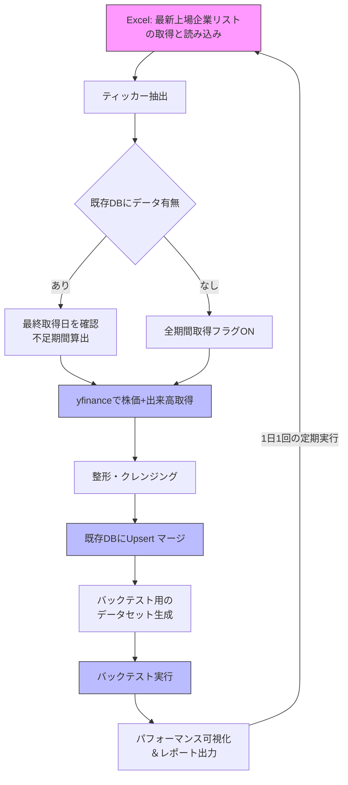

# 機械学習を用いた株式取引戦略のバックテスト


## プロジェクト概要
- 機械学習モデルを活用したアルゴリズム取引戦略を開発し、その有効性（利益を上げられたか）を過去データで検証（バックテスト）
- 例として、前日までのデータから翌日の株価上昇確率を予測し、一定以上の確率なら買い、低ければ売りといったルールで日々トレードする戦略を立てる
- 過去のデータでシミュレーションし、累積リターンや最大ドローダウン、シャープレシオなどを計算して戦略のパフォーマンスを評価
- このプロジェクトにより、単なる予測精度だけでなく実際の運用成績を意識したモデル活用方法を学ぶ
- 全コンポーネントはローカル PC またはオンプレ環境で実行  
- オーケストレーションに OSS の *Prefect 2* を採用
- 各タスクは *Docker Compose* で構築したコンテナ（CPU/GPU の使い分け可）で実行  
- ストレージは *Parquet* ファイルをローカルの `./data/` 以下に保存。  
- CI/CD は *GitHub Actions 無料枠*
- 将来拡張: EDINET/TDNET から取得した非財務情報やニュース情報を特徴量として統合

## 要件定義

|区分|内容|
|---|---|
|目的|・日本株のデータ（日次 OHLCV＋Adj Close＋volume）を用いて、ブラウザから銘柄・期間・閾値などを入力し Prefect フローをオンデマンド実行<br>・結果グラフが即座に返ってくるインタラクティブな学習環境を構築|
|機能要件|1. **Web UI**： Streamlit で銘柄複数選択・期間・閾値を入力 / `prefect api flow-run inspect` をポーリングしリアルタイム進捗表示<br>2. **API**： FastAPI が Prefect Orion REST へフロー実行リクエストを送信<br>3. **フロー構成**：`フロー構成詳細`を参照<br>4. **将来拡張**：米国株取得は Alpha Vantage を追加タスク化 / は Prefect Schedule|
|非機能要件|・レスポンスは30秒以内（ジョブが長い場合は「処理中」表示で非同期）<br>・ローカル実行や 100 % OSS／無料枠で完結できる構成|
|データ取得|・初回フルロード → 以後は差分更新<br>・初回：API が返せる最古日〜前日分まで一括取得し `data/raw/full/` へ保存<br>・毎日：`latest_date.json` を読み取り、当日分だけ API 取得し `data/raw/incr/` へ追加|
|メタデータ| `data/meta/latest_date.json` を 1 ファイル保持し Prefect Task で読み書き|
|成果物|GitHub レポジトリ、Docker Compose 定義、Prefect Flow スクリプト、Parquet データ|  
|起動方法|・UI/REST API からオンデマンド実行<br>・後日 `prefect schedule` で `"cron 0 18 * * 1-5"` を追加可|
|拡張要件|・Alpha Vantage を用いた米国株対応|  

## フロー構成詳細

1. 上場企業リスト取得
    - 最新 Excel ファイルをロードし、ティッカー（銘柄コード）列を抽出
2. 既存データのロード
    - ローカル DB に保存済みの株価・出来高データを読み込む
3. 取得範囲の判定
    - ティッカーごとに「最終取得日」を確認
    - 最終取得日が存在：その翌営業日 ～ 今日までを取得
    - 最終取得日なし：`yfinance` で取得可能な全期間を取得
4. 不足データのダウンロード
    - `yfinance` を並列化し、株価・出来高を取得
5. データ整形・品質チェック
    - 欠損・重複・企業アクション（株式併合／分割）を補正
    - インデックス（日付）・カラムを統一し、型を揃える
6. 既存データへマージ
    - `upsert` で統合テーブル／パーティションに書き戻す
7. バックテスト用データセット作成
    - リターン計算、ファクター生成、リサンプリング（週次・月次 など）
8. バックテスト実行
    - ストラテジー実装 → ポートフォリオ時系列生成 → パフォーマンス指標算出
9. 結果可視化・レポート
    - 累積リターン曲線、ドローダウン、勝率、シャープレシオなどを出力
10. スケジュール運用
    - 定期ジョブで1〜9を自動再実行し、データを継続蓄積

<br>

**フロー構成図**
  


## 使用技術スタック

|レイヤ|採用技術|理由|
|---|---|---|
|環境構築|Docker / Docker Compose|再現性の担保|
|オーケストレーション|Prefect 2 OSS|ローカル完結・GUI 付き・Python ネイティブ / タスク間の 順序・依存性を表現できる|
|フロント|Streamlit|Python だけで UI 試作が容易|
|バックエンド API|FastAPI|型安全・非同期|
|ジョブ実行|Docker Compose services / Prefect Task|コンテナ単位でタスク分離|
|データ取得|yfinance(JP)|無料で OHLCV + AdjClose + Volume が揃う|
|ETL |Polars / pandas|高速＋backtesting.py 互換|
|ML / バックテスト|scikit-learn / backtesting.py|実績豊富で調べやすい|
|ストレージ|raw: MinIO (Parquet) / processed: Iceberg / feature: Parquet + DuckDB|要件別に最適化|
|IaC|docker‑compose.yml, .env|YAML 1 ファイルで全サービス定義|
|CI/CD|GitHub Actions|無料枠|

## ディレクトリ／ファイル構成
```
project/
├── pyproject.toml          # uv add で管理する依存関係
├── uv.lock
├── requirements.txt
├── .venv/
├── Dockerfile
├── compose.yaml
├── .env
├── .gitignore
├── notebooks/
├── src/
│   ├── flows/                 # Prefect フロー定義
│   ├── tasks/                 # 個別タスク
│   └── api/                   # FastAPI App
├── scripts/                   # lint, sync など
├── data/
│   ├── raw/                   # 生データ層: 取得ログの完全保存。欠落やAPI仕様変更に備え、元データを残す
│   │   └── prices/            # yfinance 株価・出来高データ
│   ├── processed/             # 整形テーブル層: 正規化 & ACID 更新。Split‐adjust, 欠損補完などを済ませた分析・バックテストの標準ソース
│   │   └── prices/            # Iceberg テーブル
│   ├── feature/               # 特徴量層: ML モデル & 可視化 にそのまま渡せる形
│   └── meta/
│       └── latest_date.json
└── tests/
```

